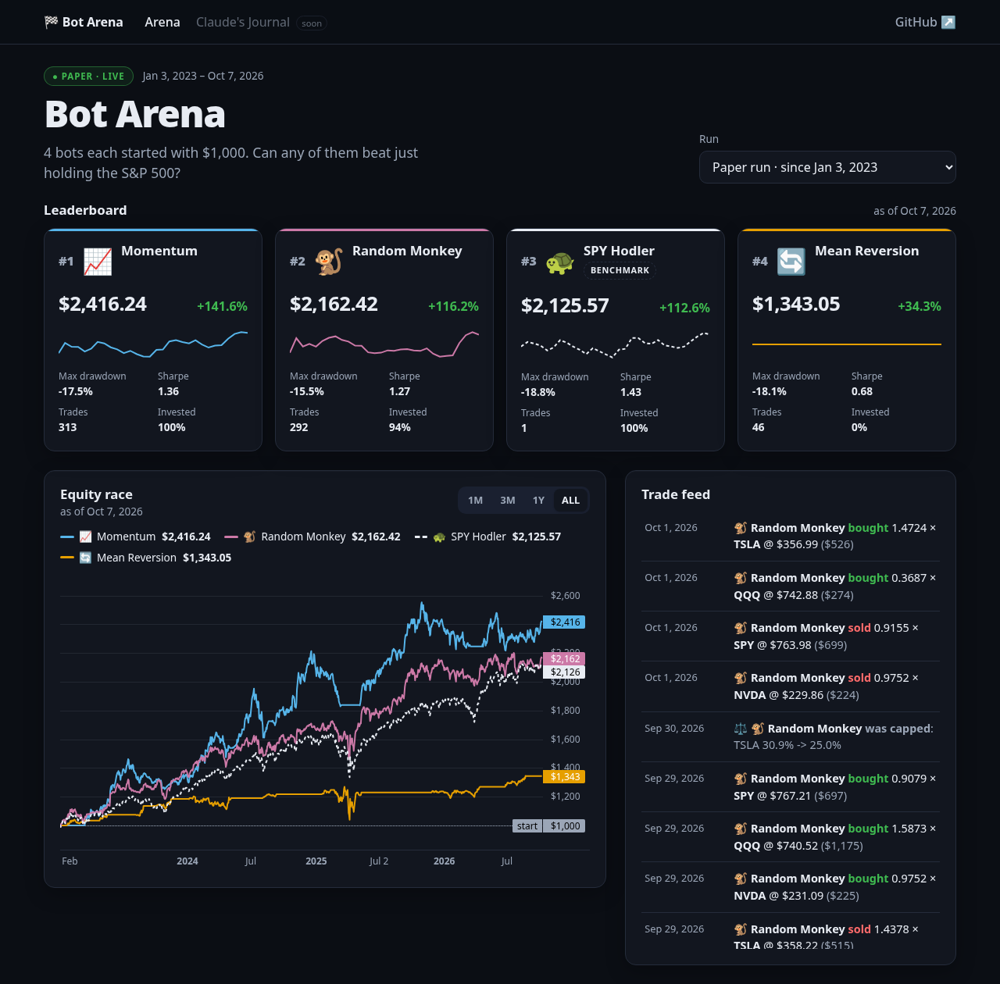
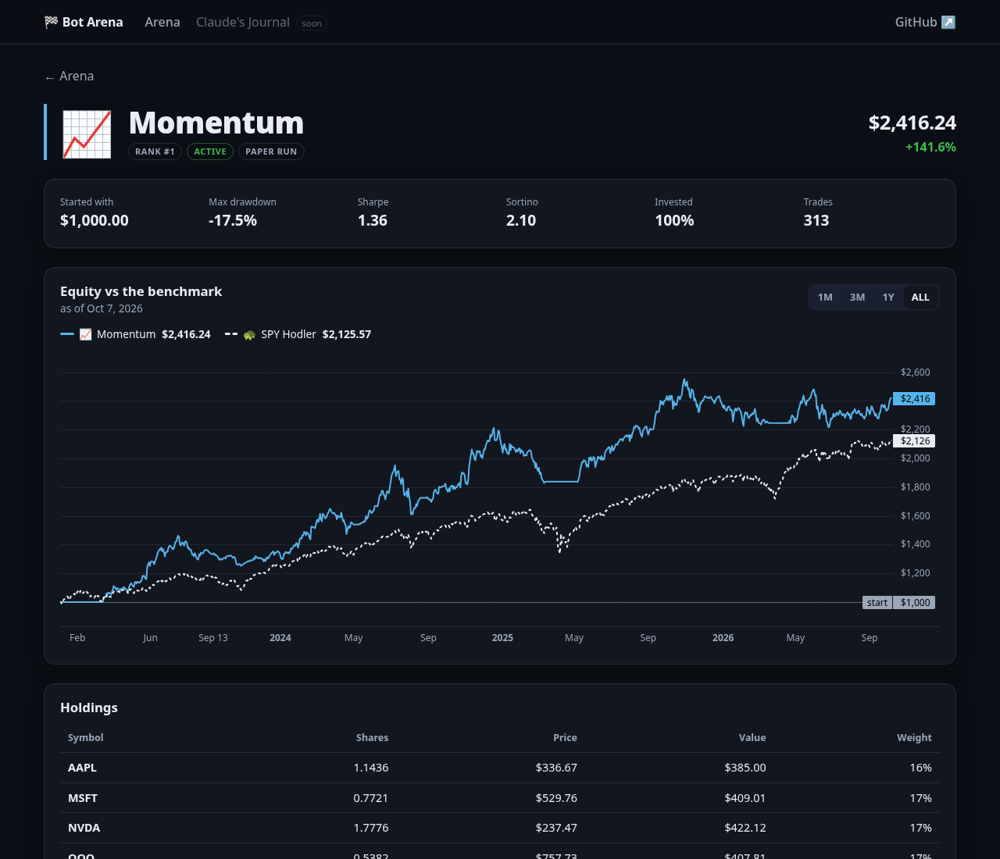

# Bot Arena

Trading bots race from **$1000 each**: classic rule-based strategies, a random monkey, and Claude as a "portfolio manager", all trying to beat simply holding the S&P 500.

Runs on **paper money** (Alpaca paper trading). See [PLAN.md](PLAN.md) for the full design: a Redpanda streaming pipeline, a risk manager with a kill switch, and a live "arena" UI.

## Status

- [x] **Phase 1: Hello market.** Download daily prices and chart $1000 bought and held in each stock.
- [x] **Phase 2: Backtester and the first bots.** Four bots race through history, with fees, slippage and a full metrics table.
- [x] **Phase 3: Database and risk manager.** Kill switch, drawdown breaker, position caps; results stored in Postgres + TimescaleDB.
- [x] **Phase 4: Streaming pipeline.** Every bot is its own service on Redpanda, paper trading live on the homelab.
- [x] **Phase 5: Arena UI.** Leaderboard, equity race, live trade feed and bot pages, on a read-only FastAPI.
- [ ] Phase 6: Claude PM
- [ ] Phase 7: Deploy to the homelab *(release pipeline done early, see Deployment)*
- [ ] Phase 8: Polish

## Quick start

Needs [uv](https://docs.astral.sh/uv/) and a free [Alpaca](https://alpaca.markets) paper account.

```sh
cp .env.example .env      # then paste your paper API keys into .env
uv sync
uv run arena account      # check the connection
uv run arena fetch        # daily bars since Jan 1 -> data/
uv run arena chart        # results table + charts/buy_and_hold.png
uv run arena backtest     # race the bots: metrics table + charts/backtest.png
```

`arena fetch --start 2023-01-01` fetches a longer history. `arena backtest --help` lists the options (slippage, fees, the monkey's seed).

## The bots

| | Bot | Strategy |
|---|---|---|
| 🐢 | **SPY Hodler** | Buys the S&P 500 on day one and never sells. The benchmark. |
| 📈 | **Momentum** | Holds every stock whose 20-day average is above its 50-day average, split equally. |
| 🔄 | **Mean Reversion** | Buys stocks that fell hard (RSI below 30) and sells when they bounce (RSI above 55). Up to 4 positions of 25% each. |
| 🐒 | **Random Monkey** | Now and then picks 1–3 random stocks with random weights. Any strategy that can't beat it has no skill. |
| 🤖 | **Claude PM** | *Coming in Phase 6.* |

## How the backtest stays honest

- **No lookahead:** a bot decides after a day's close, sees only prices up to that day, and its orders fill at the **next day's open**. A test proves the engine never hands a bot future data.
- **Costs:** every trade pays slippage (5 bps by default) and an optional fee.
- **No shorting, no margin:** weights must be positive and add up to at most 100%.

## The arena



<sub>Screenshot: 2023–2026 history replayed through the live pipeline into the database (development data). The real paper run started on 2026-10-08.</sub>

- **Leaderboard:** each bot's money, return, worst drop, Sharpe and a 30-day sparkline. The benchmark is marked, and eliminated bots are greyed out with 💀.
- **Equity race:** every bot from $1000 on one chart, SPY dashed.
- **Trade feed:** trades and risk events, updated live over a WebSocket.
- **Bot pages:** holdings, equity vs the benchmark, and every trade marked on the price chart.

| | |
|---|---|
|  | **Stack:** React 19 + TypeScript + Vite and TradingView's Lightweight Charts, on a **read-only** FastAPI ([routes](src/bot_arena/api/ROUTES.md)). A test checks there are no write endpoints, so the public site can't change anything; the kill switch stays on the command line. One Docker image serves both. |

## Risk manager

Bots only *propose* trades. Every proposal passes the risk manager first, which can shrink, drop or block it, but never make it bigger.

| Check | Rule |
|---|---|
| 🛑 Kill switch | `touch data/KILL` (optionally with a reason inside) or `ARENA_KILL_SWITCH=1`: nothing trades, not even sells |
| 💀 Drawdown breaker | A bot that falls 30% from its peak is **eliminated**: it sells everything and stays frozen |
| ⚖️ Position cap | Max 25% in a single stock; broad index funds (SPY, QQQ) may go to 100% |
| 🔢 Max positions | 6 holdings at most |
| ❓ Unknown symbols | Dropped |
| 🚫 Invalid orders | Shorting, margin or NaN weights are rejected and logged, and the arena keeps running |

Every action is logged as a risk event. `arena backtest --no-risk` turns it off for comparison, and `--max-drawdown 20` changes the elimination line.

## First results (Jan 2023 to Oct 2026, $1000 each)

With the risk manager on (the default):

| Bot | Final | Return | Sharpe | Max drawdown | Trades |
|---|---|---|---|---|---|
| 📈 Momentum | $2,416 | +142% | 1.36 | −17.5% | 313 |
| 🐒 Random Monkey | $2,162 | +116% | 1.27 | −15.5% | 292 |
| 🐢 **SPY Hodler** | **$2,126** | **+113%** | **1.43** | **−19%** | 1 |
| 🔄 Mean Reversion | $1,343 | +34% | 0.68 | −18% | 46 |

Without it (`--no-risk`):

| Bot | Final | Return | Sharpe | Max drawdown | Trades |
|---|---|---|---|---|---|
| 🐒 Random Monkey | $3,181 | +218% | 1.00 | −35% | 312 |
| 🐢 **SPY Hodler** | **$2,126** | **+113%** | **1.43** | **−19%** | 1 |
| 📈 Momentum | $2,062 | +106% | 0.99 | −31% | 361 |
| 🔄 Mean Reversion | $1,343 | +34% | 0.68 | −18% | 46 |

**The 25% cap made the bots better, not just safer.** It stops Momentum from piling into one or two stocks, so it ends with more money than SPY and nearly SPY's Sharpe. It also cuts the monkey's worst drop from −35% to −15.5%.

**Without limits, the monkey "wins", and that's the most useful result here.** Across 50 random seeds the monkey beats SPY in dollars 44 times, but on risk-adjusted return (Sharpe) only 12 times. The watchlist (NVDA, AAPL, MSFT, QQQ, TSLA) was picked in 2026, *knowing* these stocks had a huge run, so throwing darts at it mostly hits winners. That's **survivorship bias**, and it means beating SPY on this list proves very little. No rule-based bot beats SPY on risk-adjusted terms.

With a $1 fee per trade, Momentum drops from $2,062 to $1,610: at $1000, costs matter a lot.

### Known limitations

- **Hindsight watchlist** (see above) and a single 3.75-year, mostly bull-market sample. Strategy parameters aren't validated out of sample yet.
- **Sharpe and Sortino use a risk-free rate of 0.** T-bills paid ~4–5% in this period, so both are overstated.
- **Prices are adjusted for dividends,** so returns assume dividends were reinvested. A live bot would receive cash instead.
- **Fills** are at the next open with flat slippage, with no volume or liquidity limits. An order is dropped if its symbol has no price the next morning.

## Streaming pipeline

Live, every part of the arena is a separate service. They talk only through **one ordered event log**, a single-partition Redpanda topic:

```
ingest ──► bar … bar, close ──► broker ──► fill …, portfolio ──► bot × 4 ──► risk …, decision ──┐
   ▲                                │                                                           │
   │                                └───────────────── fills decisions at the next open ◄───────┘
Alpaca                     recorder ──► PostgreSQL + TimescaleDB (for the UI)
```

**Why one partition?** Kafka only guarantees order *within* a partition, and the backtest is honest only because events happen in a strict order: prices, then fills at the open, then portfolios, then decisions. With separate topics, a bot could see tomorrow's prices before its own portfolio. One ordered log removes that whole class of bugs.

That design pays off in three ways:

- **Replay = backtest, exactly.** `arena replay` pushes history through the real services. 944 days become 14,965 events, and every bot's equity matches `arena backtest` to the last cent. `arena replay --kafka TOPIC` does the same through Redpanda with each service as its own process (71 s). CI replays through a real Redpanda on every push and checks the equity matches exactly.
- **Crash-safe.** A restarted service rereads the log to rebuild its state. Every event has a deterministic id, so the service only publishes outputs that are actually missing, for example one lost in a crash. Bots that use an LLM (Phase 6) reuse their logged decisions instead of paying to ask again.
- **The run explains itself.** Its configuration is the first event, and `warmup` bars give the bots price history from before day one.

Live: `ingest` adds each trading day after Alpaca's calendar says the session closed (half days included). The broker fills the bots' decisions at the next day's open, the same timing as the backtest.

```sh
arena paper init       # once: run config + 120 days of warmup prices
arena ingest           # service
arena broker           # service
arena bot momentum     # service, one per bot
arena recorder         # service: log -> database
```

## Database

Runs, trades, equity curves and risk events can be stored in **PostgreSQL + TimescaleDB** (equity curves and price bars are hypertables).

```sh
docker compose up -d db          # local TimescaleDB, dev-only credentials
uv run arena db migrate          # create / update the schema
uv run arena backtest --save     # race the bots and store the run
uv run arena db runs             # recent runs and each bot's final equity
uv run arena db kill on --reason "market is on fire"   # stop all trading
uv run arena db kill off
```

The risk manager checks both kill switches (the database row and the local `data/KILL` file). If the database can't be read, it **fails closed** and halts trading.

## Deployment

Runs on a Proxmox LXC in the homelab (Debian 13 + Docker), from [`deploy/`](deploy/).

1. Publish a **GitHub Release** (e.g. `v0.3.0`).
2. The [Release workflow](.github/workflows/release.yml) builds the Docker image on GitHub's runners and pushes it to `ghcr.io/michalomegalul/bot-arena`.
3. On the server, `arena-deploy.timer` runs [`deploy.sh`](deploy/deploy.sh) every 5 minutes. It sees the new release, pulls the image and the release's `compose.yml`, runs the database migrations, and restarts all 11 containers (Redpanda + Console, TimescaleDB, ingest, broker, 4 bots, recorder, and the web UI on port 8000). Restarted services catch up from the log.

**Deploys are pull-based:** the repo is public, and a self-hosted runner would let any pull request run code inside the home network. Here nothing on GitHub can reach the server; it only ever reads public releases.

Secrets (Alpaca keys, database password) live only in `/opt/bot-arena/.env` on the server, readable by root only.

```sh
# on the server
cd /opt/bot-arena
docker compose ps                                  # all services
docker compose logs -f broker bot-momentum
docker compose run --rm arena db kill on --reason "stop"   # kill switch
docker compose run --rm arena db runs
systemctl list-timers arena-deploy.timer
```

## Development

```sh
uv run arena api --reload        # API on :8000 (needs DATABASE_URL)
cd web && npm ci && npm run dev  # UI on :5173, proxies /api to :8000 (or VITE_MOCK=1 without an API)
uv run pytest                    # database tests run when DATABASE_URL is set (they do in CI)
uv run ruff check . && uv run ruff format .
```
